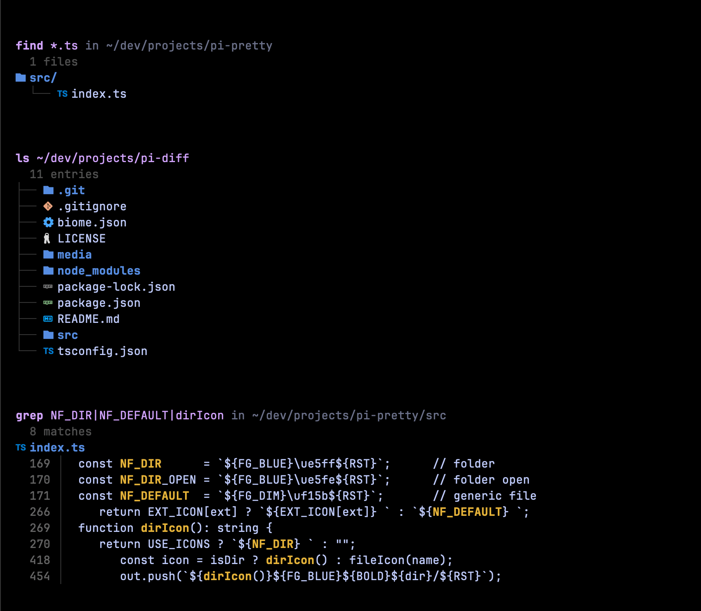

# pi-pretty

[](https://www.npmjs.com/package/@heyhuynhgiabuu/pi-pretty)
[](https://github.com/buddingnewinsights/pi-pretty/releases/latest)

A [pi](https://pi.dev) extension that upgrades built-in tool output in the terminal and includes built-in FFF-powered search for `find`/`grep`.

It currently enhances:

- **`read`**: syntax-highlighted text previews with line numbers, plus inline image rendering when the terminal supports it
- **`bash`**: colored exit summary (`exit 0`/`exit 1`) with a preview body of command output
- **`ls`**: Nerd Font file icons with tree-oriented rendering
- **`find` / `grep`**: built-in FFF-backed search with frecency-aware results, plus grouped/highlighted rendering

> Companion to [@heyhuynhgiabuu/pi-diff](https://github.com/buddingnewinsights/pi-diff) for `write`/`edit` diff rendering.

## Install

```bash
pi install npm:@heyhuynhgiabuu/pi-pretty
```

Latest release: https://github.com/buddingnewinsights/pi-pretty/releases/latest

Or load locally:

```bash
pi -e ./src/index.ts
```

## Screenshots


*`bash` exit summary + output preview, and syntax-highlighted `read` text output.*


*`ls`/`find`/`grep` with Nerd Font icons and grouped/tree-oriented rendering.*


*`read` rendering an image inline in supported terminals.*

## Terminal support for inline images

Inline image previews are supported in **Ghostty**, **Kitty**, **iTerm2**, and **WezTerm**.  
When running in **tmux**, pi-pretty uses passthrough escape sequences.

> tmux must allow passthrough. Enable it with:
>
> ```tmux
> set -g allow-passthrough on
> ```
>
> (or run once in a session: `tmux set -g allow-passthrough on`)

## Bundled FFF search

`pi-pretty` now bundles `@ff-labs/fff-node` and owns the built-in `find` / `grep` search behavior directly.

If you use bundled FFF mode, do not load `pi-fff` at the same time, because Pi extensions do not compositionally share ownership of the same built-in tool names.

FFF data is stored under a pi-pretty-specific path:

```text
~/.pi/agent/pi-pretty/fff/
```

This makes it clear that the cache belongs to this extension rather than Pi core.

## How to use it

### 1. Install and load only `pi-pretty`

```bash
pi install npm:@heyhuynhgiabuu/pi-pretty
```

Do **not** also load `pi-fff` in the same Pi setup.

### 2. Start Pi in a project

```bash
cd /path/to/your/project
pi
```

On session start, pi-pretty initializes the bundled FFF index for the current working directory.

### 3. Use the built-in tools normally

You keep using the normal built-in tool names — pi-pretty owns them directly.

Examples:

```text
find pattern="*.ts" path="src"
grep pattern="handleRequest" glob="*.ts"
read path="src/index.ts"
ls path="src"
```

### 4. Use `multi_grep` when you want OR-search across multiple strings

`multi_grep` is bundled on top of FFF and is useful when you want any of several patterns:

```text
multi_grep patterns=["handleRequest","handle_request","HandleRequest"] constraints="*.ts"
```

Good uses:
- find several naming variants at once
- search related symbols in one pass
- replace slow regex alternation with literal OR matching

### 5. Check FFF status or force a rescan

pi-pretty also provides two maintenance commands:

```text
/fff-health
/fff-rescan
```

Use them when:
- you want to confirm indexing is active
- the session started with a partial index warning
- you made large filesystem changes and want a fresh scan

### Notes

- `find` results are frecency-aware, so files you touch more often can bubble up earlier.
- `grep` and `multi_grep` can show a cursor notice when more results are available.
- If you see a partial index warning, let the session settle or run `/fff-rescan`.

## Configuration

Optional environment variables:

- `PRETTY_THEME` (overrides `~/.pi/agent/settings.json` `theme`; otherwise pi-pretty falls back to that setting before `github-dark`)
- `PRETTY_MAX_HL_CHARS` (default: `80000`)
- `PRETTY_MAX_PREVIEW_LINES` (default: `80`)
- `PRETTY_CACHE_LIMIT` (default: `128`)
- `PRETTY_ICONS` (`nerd` by default, set to `none` to disable icons)

## Development

```bash
npm install
npm run typecheck
npm run lint
npm test
```

## License

MIT — [huynhgiabuu](https://github.com/buddingnewinsights)
